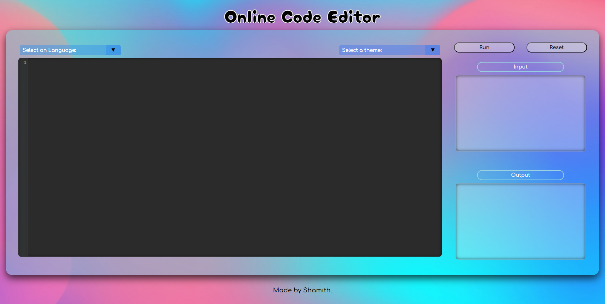

# Online_Code_Editor 

<br>
<div align="center">

[](https://github.com/iamwatchdogs?tab=repositories&q=&type=public&language=html&sort=)
[](https://github.com/iamwatchdogs?tab=repositories&q=&type=public&language=css&sort=)
[](https://github.com/iamwatchdogs?tab=repositories&q=&type=public&language=javascript&sort=)
[](https://github.com/iamwatchdogs?tab=repositories&q=&type=public&language=php&sort=)


<br>

[](https://github.com/iamwatchdogs?tab=repositories&q=&type=public&language=&sort=)
[](https://github.com/iamwatchdogs/Online_Code_Editor/pulls)
[](https://github.com/iamwatchdogs/Online_Code_Editor/issues)
[](https://github.com/iamwatchdogs/Online_Code_Editor.js/pulls?q=is%3Amerged)
[](https://GitHub.com/iamwatchdogs/Online_Code_Editor/releases/)
[](https://opensource.org/licenses/Apache-2.0)

</div>
<br>


During my internship at CodeClause, I had the opportunity to work on an exciting project called [Online_Code_Editor](https://github.com/iamwatchdogs/Online_Code_Editor). This project aimed to create a user-friendly web application where users could write and execute code directly in their browsers. It was an excellent chance for me to enhance my skills in HTML, CSS, and JavaScript, while also exploring the potential of various frameworks.

To build the frontend of the Online_Code_Editor, I leveraged the power of HTML, CSS, and JavaScript. However, to provide a seamless coding experience, I incorporated a popular framework called [CodeMirror](https://github.com/codemirror/codemirror5 "goto codemirror5 framework"). This framework offered a sophisticated text editor component with syntax highlighting, autocompletion, and other advanced features. With [CodeMirror](https://github.com/codemirror/codemirror5 "goto codemirror5 framework"), users could write code effortlessly and enjoy a smooth coding experience.

But a code editor wouldn't be complete without a backend to handle code execution and processing. For this purpose, I decided to use PHP, a server-side scripting language known for its versatility and ease of use. With PHP, I created an API that would receive code from the frontend through a POST request.

To make the code execution process smooth and asynchronous, I employed AJAX, a powerful technique for sending and receiving data from a server without disrupting the user's experience. Using AJAX, the frontend would send the code to the backend API, and the backend would execute the code using the CodeX API.

The [CodeX API](https://github.com/Jaagrav/CodeX-API "goto CodeX-API") was a game-changer in this project. It provided a reliable and secure way to execute code in various programming languages. By leveraging the capabilities of the [CodeX API](https://github.com/Jaagrav/CodeX-API "goto CodeX-API") , users of the Online_Code_Editor could see the output of their code in real-time, making the learning process interactive and engaging.

Overall, the experience of working on the Online_Code_Editor project was immensely educational and fulfilling. It allowed me to deepen my knowledge of frontend technologies like HTML, CSS, and JavaScript, while also delving into the backend realm with PHP. Incorporating AJAX for seamless communication and leveraging the power of the CodeX API for code execution were pivotal in creating a robust and user-friendly application.

I am grateful for the opportunity to contribute to CodeClause organization and for the knowledge and skills I gained during this internship. The Online_Code_Editor project not only enhanced my understanding of web development but also reinforced the importance of creating practical, interactive, and educational tools for aspiring coders.

## Contribution:

Even though this was one of the task of my internship, I think we take take it to next level. If you're a beginner and don't understand what contributing is... then hear me out, Contributing is a process where you wish to work on others' projects to implement your idea *(or)* fix errors to help/support others and improve your practical knowledge in that field. Contributing to an Open-Source such as this mini-project can help you in the long run of your technical journey. You can check [CONTRIBUTION.md](CONTRIBUTION.md "Let's go to CONTRIBUTION.md") for a more practical explanation.

To contribute to **this** repository, You need to have a good grip on the following skills:

- ***GitHub**. 

  > You need to have a basic understanding of how GitHub works.
  
- ***Git**.

  > Git acts as the local Version control and helps you connect your system with GitHub.
  
- ***Vanilla JavaScript**.

  > Vanilla JavaScript is a combination of pure HTML, CSS, and JavaScript.

- ***AJAX and PHP**

  > AJAX is used to handle async request & response. PHP is used as the backend for making API call.
  
- Other tech skills.

  > If you wish to integrate other languages, libraries, or frameworks.

You can get started by forking this repo and cloning it into your system. Here are some of the git commands you'll be using,

```bash
# Clone your forked repo into your local system
git clone https://github.com/<Your-GitHub-Name>/Online_Code_Editor.git

# Creating a new branch
git checkout -b <branch-name>

# Adding all the elements/changes into tracked/staged state
git add .

# Committing your every change
git commit -m "<message>"

# Updating your remote repo (or) pushing your commits to your forked repo
git push origin <branch-name>
```

After you're done with your changes, you can push them back to your remote repository. So that you can send me a pull request to merge the changes into the original Repository.

> Sounds too Complicated ???... Don't worry, checkout the beginner-friendly guide on how to contribute to this repo on [CONTRIBUTION.md](CONTRIBUTION.md "Let's goto CONTRIBUTION.md")

## Final Output:

<div align="center">



</div>
